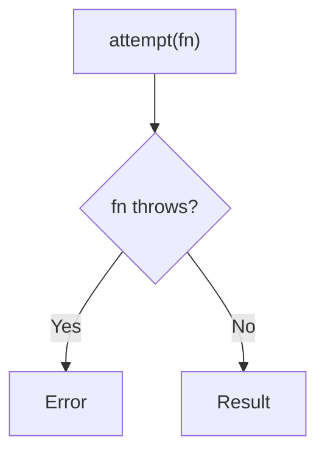

Attempts to invoke func, returning either the result or the error.
**Deprecated**: Use try-catch directly.


### Native Equivalent

```typescript
// ❌ attempt(fn)
// ✅ try { fn() } catch (e) { return e }
```
