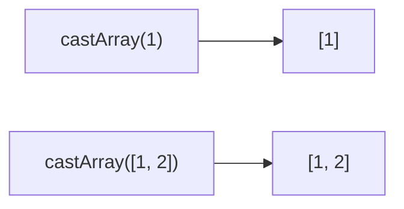

Casts value to an array if not already.
**Deprecated**: Use `Array.isArray()` with conditional.


### Native Equivalent

```typescript
// ❌ castArray(value)
// ✅ Array.isArray(value) ? value : [value]
```
