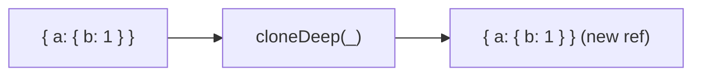

Creates a deep clone of a value.
**Deprecated**: Use `structuredClone()` directly (ES2022) or Arkhe's `deepClone`.


### Native Equivalent

```typescript
// ❌ cloneDeep(obj)
// ✅ structuredClone(obj)
// ✅ deepClone(obj)  // Arkhe
```
