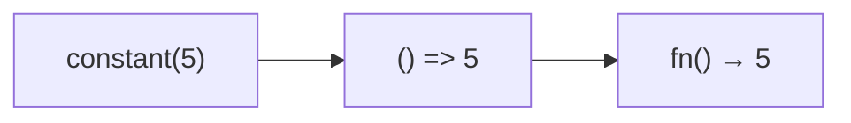

Creates a function that returns a constant value.
**Deprecated**: Use an inline arrow function `() => value` instead.


### Native Equivalent

```typescript
// ❌ constant(value)
// ✅ () => value
```
