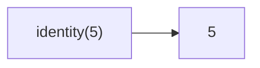

Returns the first argument it receives.
**Deprecated**: Use an inline arrow function `(x) => x` instead.


### Native Equivalent

```typescript
// ❌ arr.filter(identity)
// ✅ arr.filter(x => x)
// ✅ arr.filter(Boolean)
```
