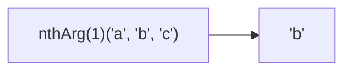

Creates a function that gets the argument at index n.
**Deprecated**: Use an arrow function.

```mermaid
flowchart LR
    A["nthArg(1)('a', 'b', 'c')"] --> B["'b'"]
```

### Native Equivalent

```typescript
// ❌ nthArg(1)
// ✅ (...args) => args[1]
```
