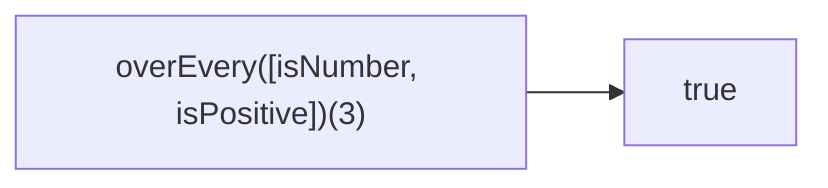

Creates a function that checks if all predicates return truthy.
**Deprecated**: Use `Array.every()` with predicates.


### Native Equivalent

```typescript
// ❌ overEvery([fn1, fn2])(value)
// ✅ [fn1, fn2].every(fn => fn(value))
```
