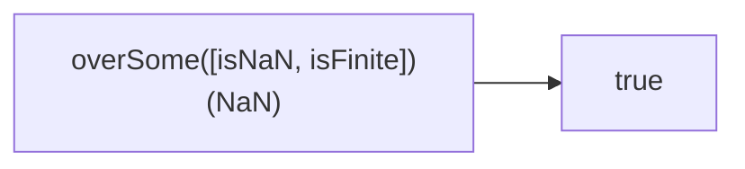

Creates a function that checks if any predicate returns truthy.
**Deprecated**: Use `Array.some()` with predicates.


### Native Equivalent

```typescript
// ❌ overSome([fn1, fn2])(value)
// ✅ [fn1, fn2].some(fn => fn(value))
```
