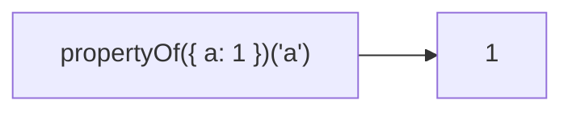

Creates a function that returns the value at path of object.
**Deprecated**: Use an arrow function.

```mermaid
flowchart LR
    A["propertyOf({ a: 1 })('a')"] --> B["1"]
```

### Native Equivalent

```typescript
// ❌ propertyOf(obj)
// ✅ key => obj[key]
```
