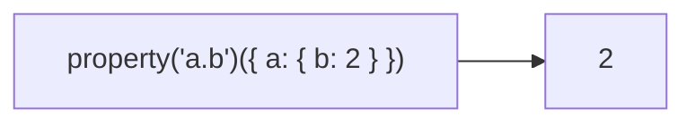

Creates a function that returns the value at path of a given object.
**Deprecated**: Use an arrow function.


### Native Equivalent

```typescript
// ❌ property('name')
// ✅ obj => obj.name
// ✅ obj => obj?.nested?.value
```
