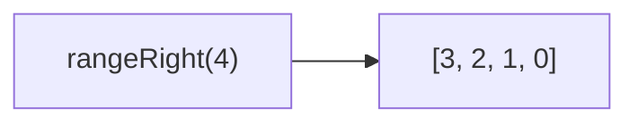

Creates a range of numbers from end to start.
**Deprecated**: Use `range()` with reverse, or generate manually.


### Native Equivalent

```typescript
// ❌ rangeRight(n)
// ✅ [...Array(n).keys()].reverse()
// ✅ Array.from({length: n}, (_, i) => n - 1 - i)
```
