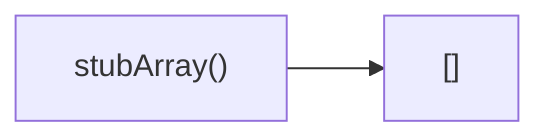

Returns an empty array.
**Deprecated**: Use `() => []` directly.

```mermaid
flowchart LR
    A["stubArray()"] --> B["[]"]
```

### Native Equivalent

```typescript
// ❌ stubArray
// ✅ () => []
```
