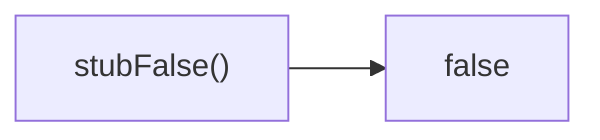

Returns `false`.
**Deprecated**: Use `() => false` directly.

```mermaid
flowchart LR
    A["stubFalse()"] --> B["false"]
```

### Native Equivalent

```typescript
// ❌ stubFalse
// ✅ () => false
```
