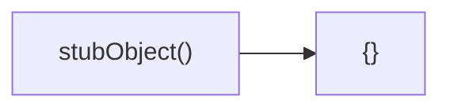

Returns an empty object.
**Deprecated**: Use `() => ({})` directly.

```mermaid
flowchart LR
    A["stubObject()"] --> B["{}"]
```

### Native Equivalent

```typescript
// ❌ stubObject
// ✅ () => ({})
```
