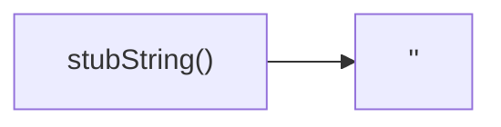

Returns an empty string.
**Deprecated**: Use `() => ''` directly.

```mermaid
flowchart LR
    A["stubString()"] --> B["''"]
```

### Native Equivalent

```typescript
// ❌ stubString
// ✅ () => ''
```
