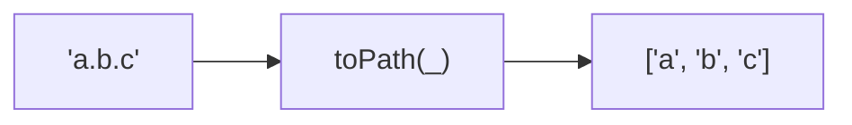

Converts string path to array of keys.
**Deprecated**: Use split or regex directly.

```mermaid
flowchart LR
    A["'a.b.c'"] --> B["toPath(_)"]
    B --> C["['a', 'b', 'c']"]
```

### Native Equivalent

```typescript
// ❌ toPath('a.b.c')
// ✅ 'a.b.c'.split('.')
```
