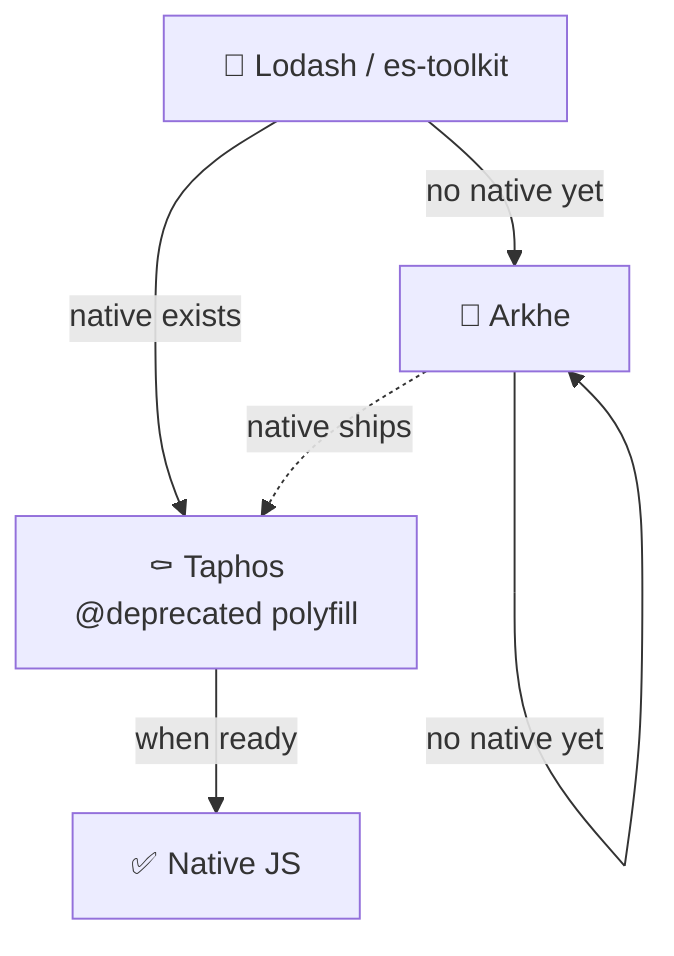

import { Picture } from "@site/src/components/shared/Picture";
import { RelatedLinks } from '@site/src/components/shared/RelatedLinks';
import ModuleName from '@site/src/components/shared/badges/ModuleName';
import { ModuleSchema } from '@site/src/components/seo/ModuleSchema';

<ModuleSchema
  name="Taphos"
  description="Strategic migration guide from Lodash to modern JavaScript and TypeScript. IDE-integrated deprecation warnings with clear migration paths."
  url="https://pithos.dev/guide/modules/taphos"
/>

# 🆃 <ModuleName name="Taphos" />

*τάφος - "tomb"  

The resting place of utilities*

Taphos is Pithos's "tomb" module: a place where utilities come to rest. Named after the Greek word for "tomb," Taphos serves two main purposes:

1. **A strategic migration guide** helping you transition from Lodash utilities to their proper replacements
2. **IDE-integrated deprecation warnings** showing the migration path directly in your editor



:::tip Progressive migration
Even before the final switch to native, migrating through Taphos already brings concrete benefits: a [smaller bundle](/comparisons/taphos/bundle-size/) and [better performance](/comparisons/taphos/bundle-size/) compared to Lodash or es-toolkit. Every step is a win.
:::

<details>
<summary>Why a Tomb?</summary>

The metaphor is intentional and meaningful:

**Dead Code**  
When a utility ends up in Taphos, it means the code is **dead**. There's a better way now: Whether native JavaScript, a Pithos alternative, or simply a different approach. The message is clear: don't use this anymore.

**A Ceremony**  
These utilities served us well. Lodash, Underscore, and similar libraries carried the JavaScript ecosystem for years. Taphos is a way to **honor their service** while acknowledging it's time to move on. It's a respectful farewell, not an unceremonious deletion.

**A Memorial to Visit**  
Like a memorial, Taphos is a place you can **visit to learn**. Want to know how to do something in modern JavaScript? Want to understand why a certain pattern is discouraged? Taphos documents these use-cases and points you to the right solution.

</details>

## The Four Types of Burials

Not all functions in Taphos are buried for the same reason. Understanding the type of burial helps you know where to migrate.

### 1. Superseded by Native JavaScript

These utilities have been replaced by native JavaScript/TypeScript APIs. The native version is now the canonical way. This is similar to what [You Don't Need Lodash/Underscore](https://github.com/you-dont-need/You-Dont-Need-Lodash-Underscore) documents.

```typescript links="flatten:/api/taphos/array/flatten"
// Buried in Taphos
import { flatten } from "pithos/taphos/array/flatten";
const flat = flatten([[1, 2], [3, 4]]);

// ✅ Native replacement, see Array.prototype.flat() on MDN
const flat = [[1, 2], [3, 4]].flat();
```

**Migration direction:** Taphos → Native JavaScript

### 2. Native Exists but Violates Pithos Principles

Some native JavaScript functions exist but go against Pithos's design principles, typically because they **mutate** data. These are buried to discourage their use in favor of immutable Pithos alternatives.

```typescript
// ❌ Native sort mutates
const arr = [3, 1, 2];
arr.sort(); // arr is now [1, 2, 3] - mutated!

// ✅ Use Pithos immutable alternative
import { sort } from "pithos/arkhe/array/sort";
const sorted = sort([3, 1, 2]); // Returns new array, original unchanged
```

**Migration direction:** Taphos → Arkhe (Pithos immutable alternative)

### 3. Aliases for Migration Convenience

Some functions in Taphos aren't truly "dead": they're **aliases** that redirect to the canonical Pithos function. These exist to help developers coming from other libraries (Lodash, Ramda, etc.) find the right function.

```typescript links="castArray:/api/taphos/util/castArray,toArray:/api/arkhe/array/toArray"
// Alias in Taphos (Lodash naming)
import { castArray } from "pithos/taphos/util/castArray";

// ✅ Canonical Pithos function
import { toArray } from "pithos/arkhe/array/toArray";

// Both do the same thing, but 'toArray' is the canonical name in Pithos
```

This isn't a real burial, it's a **signpost** saying "you're looking for X? It's over here now."

**Migration direction:** Taphos alias → Canonical Pithos function

### 4. Marked for Future Burial

Some utilities are still in Arkhe but have a known native replacement that's too recent to use. They're living on borrowed time: once the target ES version allows it, they'll be moved to Taphos.

Think of it as a reserved plot in the cemetery. We know who's going there, just not when.

```typescript links="groupBy:/api/arkhe/array/groupBy"
// Still in Arkhe (targeting ES2020)
import { groupBy } from "pithos/arkhe/collection/groupBy";
const grouped = groupBy(users, (user) => user.role);

// Future native replacement (ES2024) - not yet available for our target
// const grouped = Object.groupBy(users, (user) => user.role);
```

**Status:** Arkhe (for now) → Taphos (when ES target allows)

## ⛵️ IDE-Guided Migration {#ide-guided-migration}

Every function in Taphos is marked `@deprecated` and includes its migration path directly in the TSDoc. This means your IDE shows you exactly what to use instead, without leaving your editor.

```typescript links="at:/api/taphos/array/at"
import { at } from "pithos/taphos/array/at";
//       ^^ Your IDE shows: "Deprecated: Use native Array.prototype.at() instead"
```

When you hover over a Taphos function or see the deprecation warning, the TSDoc tells you:
- **Why** it's deprecated (native replacement, Arkhe alternative, etc.)
- **What** to use instead
- **How** to migrate with code examples

<Picture src="/img/generated/taphos/ide-hint" alt="Taphos TSDoc migration hints showing deprecation warnings and replacement suggestions in IDE" widths={[400, 800, 1200, 1600]} sizes="100vw" />

This makes migration progressive and frictionless: you can keep using Taphos functions while gradually replacing them, guided by your IDE at each step. They'll stay marked `@deprecated` as long as you use them, a quiet reminder that a migration is possible.

---

<RelatedLinks title="Related Resources">

- [When to use Taphos](/comparisons/overview/) — Compare Pithos modules with alternatives and find when each is the right choice
- [Taphos bundle size & performance](/comparisons/taphos/bundle-size/) — Detailed bundle size data for Taphos
- [Taphos API Reference](/api/taphos) — Complete API documentation for all Taphos functions
- [Taphos native equivalence table](/comparisons/taphos/native-equivalence/) — Detailed classification of which functions have direct native equivalents, compositions, or custom implementations
- [Full Lodash-to-Pithos equivalence table](/comparisons/equivalence-table/) — Maps every Lodash function to its Pithos replacement

</RelatedLinks>
