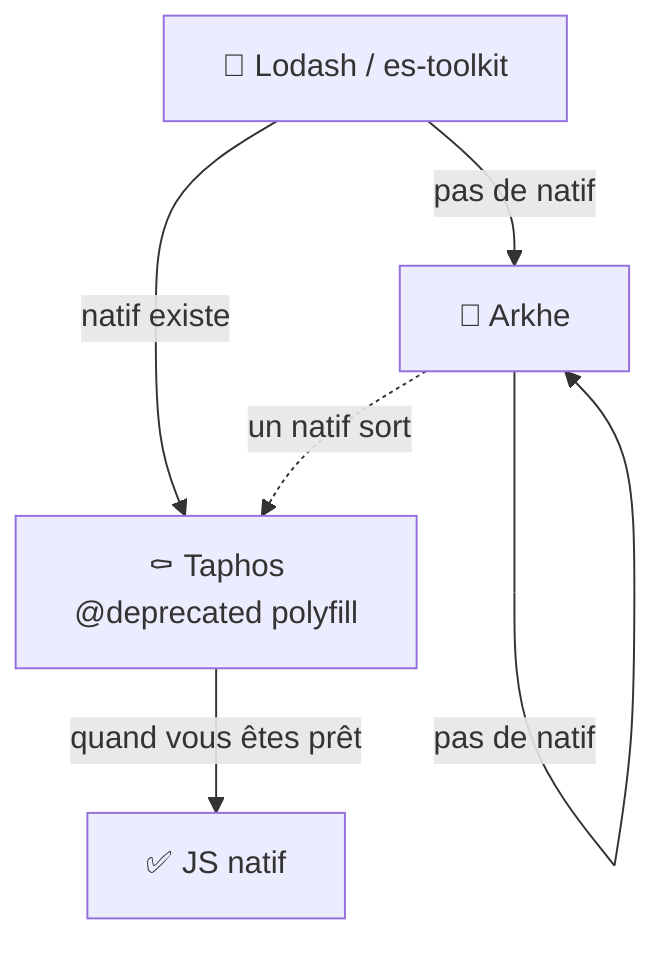

import { Picture } from "@site/src/components/shared/Picture";
import { RelatedLinks } from '@site/src/components/shared/RelatedLinks';
import ModuleName from '@site/src/components/shared/badges/ModuleName';
import { ModuleSchema } from '@site/src/components/seo/ModuleSchema';

<ModuleSchema
  name="Taphos"
  description="Guide de migration stratégique de Lodash vers JavaScript et TypeScript modernes. Avertissements de dépréciation intégrés à l'IDE avec des chemins de migration clairs."
  url="https://pithos.dev/guide/modules/taphos"
/>

# 🆃 <ModuleName name="Taphos" />

*τάφος - « tombe »

Le lieu de repos des utilitaires*

Taphos est le module « tombe » de Pithos : un endroit où les utilitaires viennent se reposer. Nommé d'après le mot grec pour « tombe », Taphos sert deux objectifs principaux :

1. **Un guide de migration stratégique** vous aidant à passer des utilitaires Lodash à leurs remplacements appropriés
2. **Des avertissements de dépréciation intégrés à l'IDE** montrant le chemin de migration directement dans votre éditeur



:::tip Migration progressive
Même avant la migration finale vers le natif, passer par Taphos apporte déjà des bénéfices concrets : un [bundle plus léger](/comparisons/taphos/bundle-size/) et de [meilleures performances](/comparisons/taphos/bundle-size/) par rapport à Lodash ou es-toolkit. Chaque étape est un gain.
:::

<details>
<summary>Pourquoi une tombe ?</summary>

La métaphore est intentionnelle et significative :

**Code mort**  
Quand un utilitaire finit dans Taphos, cela signifie que le code est **mort**. Il y a une meilleure façon maintenant : que ce soit du JavaScript natif, une alternative Pithos, ou simplement une approche différente. Le message est clair : ne l'utilisez plus.

**Une cérémonie**  
Ces utilitaires nous ont bien servi. Lodash, Underscore et les bibliothèques similaires ont porté l'écosystème JavaScript pendant des années. Taphos est une façon d'**honorer leur service** tout en reconnaissant qu'il est temps de passer à autre chose. C'est un adieu respectueux, pas une suppression sans cérémonie.

**Un mémorial à visiter**  
Comme un mémorial, Taphos est un endroit que vous pouvez **visiter pour apprendre**. Vous voulez savoir comment faire quelque chose en JavaScript moderne ? Vous voulez comprendre pourquoi un certain pattern est déconseillé ? Taphos documente ces cas d'usage et vous oriente vers la bonne solution.

</details>

---

## Les quatre types d'enterrements

Toutes les fonctions dans Taphos ne sont pas enterrées pour la même raison. Comprendre le type d'enterrement vous aide à savoir où migrer.

### 1. Remplacé par du JavaScript natif

Ces utilitaires ont été remplacés par des API JavaScript/TypeScript natives. La version native est maintenant la façon canonique. C'est similaire à ce que documente [You Don't Need Lodash/Underscore](https://github.com/you-dont-need/You-Dont-Need-Lodash-Underscore).

```typescript links="flatten:/api/taphos/array/flatten"
// Enterré dans Taphos
import { flatten } from "@pithos/core/taphos/array/flatten";
const flat = flatten([[1, 2], [3, 4]]);

// ✅ Remplacement natif, voir Array.prototype.flat() sur MDN
const flat = [[1, 2], [3, 4]].flat();
```

**Direction de migration :** Taphos → JavaScript natif

### 2. Le natif existe mais viole les principes Pithos

Certaines fonctions JavaScript natives existent mais vont à l'encontre des principes de conception de Pithos, typiquement parce qu'elles **mutent** les données. Elles sont enterrées pour décourager leur utilisation en faveur d'alternatives Pithos immuables.

```typescript
// ❌ Le sort natif mute
const arr = [3, 1, 2];
arr.sort(); // arr est maintenant [1, 2, 3] - muté !

// ✅ Utilisez l'alternative immuable Pithos
import { sort } from "@pithos/core/arkhe/array/sort";
const sorted = sort([3, 1, 2]); // Retourne un nouveau tableau, l'original inchangé
```

**Direction de migration :** Taphos → Arkhe (alternative immuable Pithos)

### 3. Alias pour faciliter la migration

Certaines fonctions dans Taphos ne sont pas vraiment « mortes » : ce sont des **alias** qui redirigent vers la fonction Pithos canonique. Elles existent pour aider les développeurs venant d'autres bibliothèques (Lodash, Ramda, etc.) à trouver la bonne fonction.

```typescript links="castArray:/api/taphos/util/castArray,toArray:/api/arkhe/array/toArray"
// Alias dans Taphos (nommage Lodash)
import { castArray } from "@pithos/core/taphos/util/castArray";

// ✅ Fonction Pithos canonique
import { toArray } from "@pithos/core/arkhe/array/toArray";

// Les deux font la même chose, mais 'toArray' est le nom canonique dans Pithos
```

Ce n'est pas un vrai enterrement, c'est un **panneau indicateur** disant « vous cherchez X ? C'est par ici maintenant. »

**Direction de migration :** Alias Taphos → Fonction Pithos canonique

### 4. Marqué pour un futur enterrement

Certains utilitaires sont encore dans Arkhe mais ont un remplacement natif connu qui est trop récent pour être utilisé. Ils vivent en sursis : une fois que la version ES cible le permettra, ils seront déplacés vers Taphos.

Pensez-y comme une parcelle réservée au cimetière. On sait qui y va, juste pas quand.

```typescript links="groupBy:/api/arkhe/array/groupBy"
// Encore dans Arkhe (ciblant ES2020)
import { groupBy } from "@pithos/core/arkhe/collection/groupBy";
const grouped = groupBy(users, (user) => user.role);

// Futur remplacement natif (ES2024) - pas encore disponible pour notre cible
// const grouped = Object.groupBy(users, (user) => user.role);
```

**Statut :** Arkhe (pour l'instant) → Taphos (quand la cible ES le permettra)

## ⛵️ Migration guidée par l'IDE

Chaque fonction dans Taphos est marquée `@deprecated` et inclut son chemin de migration directement dans le TSDoc. Cela signifie que votre IDE vous montre exactement quoi utiliser à la place, sans quitter votre éditeur.

```typescript links="at:/api/taphos/array/at"
import { at } from "@pithos/core/taphos/array/at";
//       ^^ Votre IDE affiche : "Deprecated: Utilisez le natif Array.prototype.at() à la place"
```

Quand vous survolez une fonction Taphos ou voyez l'avertissement de dépréciation, le TSDoc vous dit :
- **Pourquoi** c'est déprécié (remplacement natif, alternative Arkhe, etc.)
- **Quoi** utiliser à la place
- **Comment** migrer avec des exemples de code

<Picture src="/img/generated/taphos/ide-hint" alt="Indices de migration TSDoc Taphos montrant les avertissements de dépréciation et les suggestions de remplacement dans l'IDE" widths={[400, 800, 1200, 1600]} sizes="100vw" />

<br/>
Cela rend la migration progressive et sans friction : vous pouvez continuer à utiliser les fonctions Taphos tout en les remplaçant progressivement, guidé par votre IDE à chaque étape. Elles resteront marquées `@deprecated` tant que vous les utiliserez, un rappel discret qu'une migration est possible.

---

<RelatedLinks title="Ressources associées">

- [Quand utiliser Taphos](/comparisons/overview/) — Comparez les modules Pithos avec les alternatives
- [Taille de bundle & performance de Taphos](/comparisons/taphos/bundle-size/) — Données détaillées de taille de bundle pour Taphos
- [Référence API Taphos](/api/taphos) — Documentation API complète pour toutes les fonctions Taphos
- [Table d'équivalence native Taphos](/comparisons/taphos/native-equivalence/) — Classification détaillée des fonctions ayant des équivalents natifs directs
- [Table d'équivalence complète Lodash-vers-Pithos](/comparisons/equivalence-table/) — Correspondance de chaque fonction Lodash vers son remplacement Pithos

</RelatedLinks>
