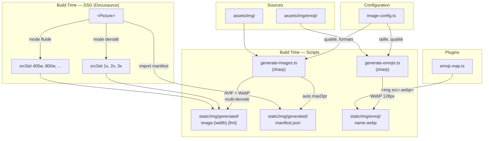

# Architecture — Pipeline d'images Pithos

## Vue d'ensemble

Le pipeline d'images de Pithos génère des variantes responsives optimisées au build time,
servies au runtime via le composant `<Picture>`. Deux pipelines coexistent :

- **Images** : `generate-images.ts` → variantes AVIF + WebP multi-densité/breakpoints + manifest
- **Emojis** : `generate-emojis.ts` → WebP unique à 128px (2× la taille d'affichage max)



```
assets/img/           ← Sources (PNG/JPG, haute résolution)
  ├── homepage/       ← Icônes features (250×250)
  ├── modules/        ← Lettres modules (256×256)
  ├── logos/          ← Logo Pithos (540×790)
  ├── taphos/         ← Screenshots
  └── emoji/          ← Sources emoji (256×256)

static/img/           ← Fichiers générés (committés dans Git)
  ├── generated/      ← Variantes images (AVIF + WebP)
  │   ├── homepage/   ← battle_tested-125.avif, -250.webp, ...
  │   ├── modules/    ← letter-a-128.avif, -256.webp, ...
  │   ├── logos/      ← pithos-180.avif, -360.webp, ...
  │   └── manifest.json ← maxDpr effectif par image
  └── emoji/          ← Emojis WebP (gate.webp, flash.webp, ...)
```

## Pourquoi ce pipeline ?

### Problème

Docusaurus n'a pas de pipeline d'images natif. Le plugin `@docusaurus/plugin-ideal-image` est limité
(pas de multi-format AVIF/WebP, pas de density descriptors, pas de contrôle DPR).

Sans pipeline, on se retrouve avec :
- Des images servies en PNG/JPG pleine résolution → poids excessif
- Pas de format moderne (AVIF/WebP)
- Pas de Retina adaptatif (tout le monde reçoit la même image)
- CLS non maîtrisé (pas de `width`/`height` intrinsèques)

### Ce que ça apporte

| Gain | Détail |
|------|--------|
| Poids réduit ~85-95% | AVIF + WebP vs PNG source. Ex : 1.4 Mo de sources → ~250 Ko en AVIF 1x+2x |
| Retina net sans gaspillage | Density descriptors (`1x`, `2x`, `3x`) au lieu de servir du 3x à tout le monde |
| DX zéro-config | Le dev écrit `<Picture src={...} displaySize={125} />`, le manifest gère le maxDpr automatiquement |
| CLS prevention | `width`/`height` émis sur le `` → pas de layout shift |
| LCP optimisé | `priority` → `loading="eager"` + `fetchpriority="high"` pour l'image above-the-fold |
| Idempotent | Le script ne régénère que si la source a changé (mtime). Diffs Git propres |
| Pas de runtime | Tout est résolu au build time (SSG). Zéro JS côté client pour le choix d'image |

### Compromis et limites

| Compromis | Justification |
|-----------|---------------|
| Fichiers générés committés dans Git | Évite d'avoir `sharp` en CI, previews de PR immédiates. Contrepartie : le repo grossit (~2 Mo). Acceptable pour un site statique |
| Pas de lazy generation (on-demand) | Tout est pré-généré. Pas adapté à un CMS avec des milliers d'images, mais parfait pour un site de docs avec ~15 images |
| Parsing JSX statique (regex) | Le script parse les props via regex, pas un vrai AST. Les expressions dynamiques (`displaySize={ICON_SIZE}`) ne sont pas résolues → warning + skip. Suffisant pour un usage interne, mais un vrai parser (babel/ts-morph) serait nécessaire pour un plugin public |
| PNG/JPG gardés en code mort | Le support PNG/JPG reste dans le script et le composant mais n'est plus utilisé. Sortie de secours si un navigateur exotique pose problème |
| Manifest = couplage script↔composant | Le composant dépend du manifest généré par le script. Si le script n'a pas tourné, le composant tombe sur `[1, 2, 3]` par défaut → potentiels 404 sur les variantes manquantes. En pratique, le script tourne toujours avant le build |
| Emojis séparés du pipeline principal | Les emojis sont trop petits (24-64px CSS) pour justifier `<picture>` + AVIF. Un simple `` WebP 128px suffit. Deux pipelines = un peu plus de code, mais chacun est simple |

## Composant `<Picture>`

### Deux modes

| Mode | Activé par | srcSet | Cas d'usage |
|------|-----------|--------|-------------|
| Densité | `displaySize` | `1x, 2x` | Images à taille CSS fixe (icônes, logos) |
| Fluide | `widths` + `sizes` | `400w, 800w, ...` | Images pleine largeur (screenshots) |

### Props principales

```tsx
<Picture
  src="/img/generated/homepage/battle_tested"
  alt="Battle tested"
  displaySize={125}       // Taille CSS d'affichage → active le mode densité
  maxDpr={2}              // Cap le DPR max (optionnel, défaut: auto via manifest)
  width={125}             // Attribut HTML pour CLS prevention (optionnel en mode densité)
  height={125}
/>
```

#### Props de dimensionnement — qui fait quoi

| Prop | Rôle | Obligatoire ? |
|------|------|---------------|
| `displaySize` | Taille CSS cible. Sert à calculer les variantes (×1, ×2, ×3). Active le mode densité | Oui (mode densité) |
| `width` / `height` | Attributs HTML sur le ``. Le navigateur réserve l'espace avant chargement (CLS prevention) | Non — si absent, `width` = `displaySize` automatiquement |
| `sourceWidth` / `sourceHeight` | Dimensions de la source originale. Servent à calculer le ratio d'aspect pour `height` auto et à capper les densités côté client | Non — le script les détecte via sharp |

En pratique, pour une image carrée : `displaySize={125}` suffit. Le composant émet
`width=125` automatiquement. Écrire `width={125} height={125}` en plus est redondant
mais explicite — utile si l'image n'est pas carrée ou si on veut forcer une hauteur.

Pour une image non carrée sans `height` explicite : si `sourceWidth` et `sourceHeight`
sont fournis, le composant calcule `height = displaySize × sourceHeight / sourceWidth`.
Sinon, `height` est omis (le navigateur ne peut pas réserver l'espace vertical → CLS possible).

#### Autres props

- `maxDpr` : cap le DPR maximum. Sans `maxDpr`, le composant consulte le manifest
  (généré par le script). Si ni prop ni manifest → `[1, 2, 3]` par défaut.
- `densities` : force des densités explicites, même si ça implique de l'upscale.
  Le script génère quand même mais warn.
- `formats` : défaut `['avif', 'webp']`. Le dernier format est le fallback ``,
  les précédents deviennent des `<source>`.
- `priority` : `true` → `loading="eager"` + `fetchpriority="high"` + `decoding="sync"`.
  Pour l'image LCP (above-the-fold).

### Calcul des densités (`picture-utils.ts`)

```
computeDensities(displaySize, sourceWidth?, explicitDensities?, maxDpr?)
```

1. Si `explicitDensities` fourni → utilisé tel quel (force l'upscale si nécessaire)
2. Sinon → `[1, 2, 3]`, filtré par :
   - `maxDpr` : exclut les densités > maxDpr
   - `sourceWidth` : exclut si `displaySize × d > sourceWidth`

```
computeWidths(displaySize, densities, sourceWidth?)
```

Pour chaque densité `d` : `width = displaySize × d`, cappé à `sourceWidth`, dédupliqué.

### Manifest auto-inject (`manifest.json`)

Le script génère `static/img/generated/manifest.json` après traitement de toutes les images.
Ce fichier mappe chaque `src` à son `maxDpr` effectif (calculé à partir de la largeur source réelle).

```json
{
  "/img/generated/homepage/battle_tested": { "maxDpr": 2, "widths": [125, 250] },
  "/img/generated/logos/pithos": { "maxDpr": 3, "widths": [180, 360, 540] }
}
```

Le composant `<Picture>` importe le manifest au build time (SSG) et l'utilise comme fallback :

1. `maxDpr` explicite dans le JSX → respecté (cap du dev, jamais dépassé)
2. Pas de `maxDpr` → le manifest fournit le max sans upscale
3. `densities` explicite → force la génération même avec upscale (le script warn)

Cela signifie que le dev n'a jamais besoin de calculer `maxDpr` à la main.
Le script le détermine automatiquement à partir de la source.

### Exemple concret

```tsx
// Icône homepage : affichée à 125px, source 250px
// → manifest dit maxDpr=2, pas besoin de le spécifier
<Picture src={icon} displaySize={125} />
// → densités [1, 2] → widths [125, 250]
// → srcSet: "icon-125.avif 1x, icon-250.avif 2x"

// Logo Pithos : affiché à 180px, source 540px
// → manifest dit maxDpr=3, 3x généré automatiquement
<Picture src="/img/generated/logos/pithos" displaySize={180} />
// → densités [1, 2, 3] → widths [180, 360, 540]
// → srcSet: "pithos-180.avif 1x, pithos-360.avif 2x, pithos-540.avif 3x"

// Cap explicite du dev : même si la source permet 3x, on bloque à 2x
<Picture src="/img/generated/logos/pithos" displaySize={180} maxDpr={2} />
// → densités [1, 2] → widths [180, 360]

// Force upscale : densities explicite, le script génère même si > source
<Picture src={icon} displaySize={125} densities={[1, 2, 3]} />
// → widths [125, 250, 375] — 375 upscalé, le script warn

// Screenshot fluide : breakpoints explicites
<Picture src="/img/generated/taphos/ide-hint" widths={[400, 800, 1200, 1600]} sizes="100vw" />
// → srcSet: "ide-hint-400.avif 400w, ide-hint-800.avif 800w, ..."
```

### HTML généré (mode densité)

```html
<picture>
  <source type="image/avif" srcset="icon-125.avif 1x, icon-250.avif 2x" />
  
</picture>
```

Le dernier format (`webp`) sert de fallback ``. Les formats précédents (`avif`)
sont des `<source>` avec `type=`. Le navigateur choisit le meilleur format supporté.

## Script `generate-images.ts`

### Fonctionnement

1. Scanne `src/`, `docs/`, `comparisons/` pour les usages `<Picture>`
2. Parse les props : `src`, `displaySize`, `maxDpr`, `sourceWidth`, `widths`, `formats`, `densities`
3. Calcule les widths via `computeDensities` + `computeWidths` (même logique que le composant)
4. Pour chaque width × format, génère la variante via `sharp`
5. Anti-upscaling : skip les widths > largeur source réelle (sauf si `densities` explicite → upscale avec warning)
6. Post-check : si une variante du même format que la source est plus lourde → copie la source
7. Génère `static/img/generated/manifest.json` avec le `maxDpr` effectif de chaque image

### Parsing des props

Seuls les littéraux numériques sont supportés (`displaySize={125}`).
Les expressions dynamiques (`displaySize={ICON_SIZE}`) émettent un warning et sont ignorées.

Pour les `<Picture src={variable}>` dynamiques, le script suit les imports pour résoudre
les chemins `/img/generated/...` dans les fichiers de données.

### Formats de sortie

Défaut : `['avif', 'webp']`. PNG et JPG restent supportés par le script et le composant
mais ne sont plus utilisés sur le site. Le support est conservé comme sortie de secours.

### Reporting

Le script affiche deux tableaux de stats :
- **Fixed (density mode)** : colonnes 1x, 2x, 3x — delta vs sources
- **Fluid (breakpoints)** : colonnes 400w, 800w, ... — delta vs sources

## Script `generate-emojis.ts`

### Fonctionnement

1. Scanne `assets/img/emoji/*.png`
2. Redimensionne à `min(128, sourceWidth)` — pas d'upscaling
3. Convertit en WebP (qualité 90)
4. Sortie dans `static/img/emoji/{name}.webp`
5. Idempotent : skip si output plus récent que source (mtime)

### Pourquoi pas `<Picture>` pour les emojis ?

Les emojis sont affichés à 24-64px CSS. À cette taille, un seul fichier WebP à 128px
(2× la taille max) suffit. Le gain d'AVIF vs WebP est négligeable à ces dimensions.
Les emojis sont servis via `` directement.

## Configuration (`image-config.ts`)

```typescript
// Qualité de compression par format
export const DEFAULT_QUALITY = { avif: 65, webp: 75, png: 9 };

// Pipeline emoji
export const EMOJI_CONFIG = {
  maxDisplaySize: 64,   // Taille CSS max des emojis
  targetDensity: 2,     // Couverture Retina 2×
  targetSize: 128,      // 64 × 2
  webpQuality: 90,
};
```

## Fichiers

| Fichier | Rôle |
|---------|------|
| `src/components/shared/Picture/index.tsx` | Composant React `<Picture>` |
| `src/components/shared/Picture/picture-utils.ts` | `computeDensities`, `computeWidths` (pur, testable) |
| `static/img/generated/manifest.json` | Manifest auto-généré : maxDpr effectif par image |
| `scripts/generate-images.ts` | Génération des variantes images + manifest |
| `scripts/generate-emojis.ts` | Génération des emojis WebP |
| `scripts/image-config.ts` | Configuration partagée (qualité, emoji) |
| `plugins/emoji-map.ts` | Mapping emoji → chemin WebP |


## Roadmap

Ce pipeline est prévu pour être extrait en plugin Docusaurus réutilisable.
Points à adresser pour la publication :

- Remplacer le parsing regex par un vrai parser AST (babel/ts-morph)
- Intégrer le script dans le lifecycle Docusaurus (hook `postBuild` ou plugin webpack)
- Exposer la configuration via `docusaurus.config.js`
- Packager le composant `<Picture>` avec le plugin
- Gérer le manifest via le système de plugins Docusaurus
